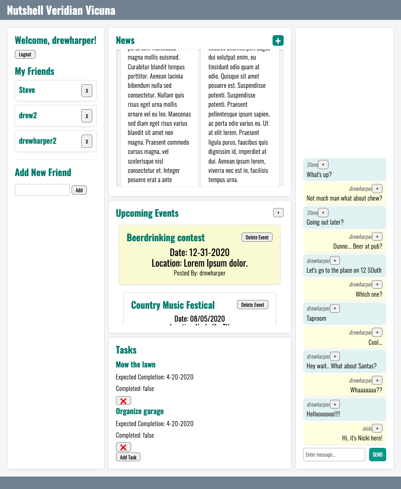

# Nutshell: The Information Dashboard



Link to our Sketchboard:
https://sketchboard.me/zB4qio8EfUXV#/

## Setup: Follow these steps exactly

1. Clone this repository
1. `cd` into the directory it creates
1. Make a `database.json` file in the `api` directory
1. Delete the `.ignore` file in the `api` directory

> **Note:** Your `database.json` file is already in the `.gitignore` file for this project, so it will never be added to the repo or pushed to Github.

## Instructions

Nutshell is a new product offering that you have been tasked with building. It's a dashboard for people to use to organize their daily tasks, events, news article, friends, and chat messages.

You will be utilizing all of the skills and concepts that you've learned up to this point in the course.

1. Functions
1. Databases
1. Github
1. Objects
1. CSS/Flexbox
1. Array methods
1. Components
1. Handling user and custom events
1. Implementing CRUD operations
1. Relational data
1. ERDs

To start you off, here's an example of what the resources in your API should look like once it's populated with some data from your application.

### Users

```json
{ "id": 1, "username": "Steve", "email": "me@me.com", "password": "xxxxxxxxxxxxxxxxxxxxx" }
```

### Messages

```json
{ "id": 1, "userId": 1, "message": "What's up?" }
```

### News

```json
{
    "id": 1,
    "userId": 2,
    "url": "https://www.quantamagazine.org/newfound-wormhole-allows-information-to-escape-black-holes-20171023/",
    "title": "Wormholes Allow Information to Escape Black Holes",
    "synopsis": "Check out this recent discovery about workholes"
}
```

### Friends

```json
{ "id": 1, "userId": 1, "following": 3 }
```

### Tasks

```json
{ "id": 1, "userId": 3, "task": "Take out garbage", "complete": false }
```

## Professional Requirements

1. Each module should have a comment at the top with the following info: author(s) and purpose of module
1. The README for your project should include instructions on how another person can download and run the application

## How to Handle Authentication

Be very clear that what you will be implemeting is not real authentication. It is a simulation of it using very simplistic tools.

You will be using session storage to keep track of which user has logged into Nutshell. When the user fills out the registration form, you will POST their email, username and password to the `users` collection in your API. You will then immediately take the `id` of the object in the response and save it to [session storage](https://javascript.info/localstorage#sessionstorage).

```js
sessionStorage.setItem("activeUser", user.id)
```

If you want to add a Logout feature, all you need to do it remove the session storage item.

```js
sessionStorage.removeItem("activeUser")
```

# Wireframe, Dependency Graph, droplr image:
https://d.pr/i/K8AD1X

